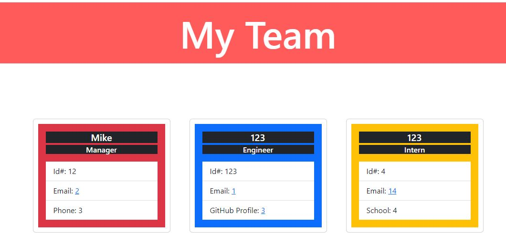

  # Team Profile Generator []

  ## Table of Contents
  - [Description](#Description)
  - [Test](#Test)
  - [Usage](#Usage)
  - [License](#License)
  - [Questions](#Questions)

  ## Description
    Simple generator that creates a website for a team profile with Engineers and Interns under a single Manager.

    This prompts user with a series of questions that will make entering information more efficiently resulting in a nice clean website.
    

  ## Usage
    Download files
    - 
    Run node
    Answer prompt questions
    Select entry types
    Once complete select end point
    Open new html file that was created
    

https://youtu.be/RiWLqwIeNLI
    

  ## Test
    Not yet available
    

  ## License
    
    MIT License

    Permission is hereby granted, free of charge, to any person obtaining a copy
    of this software and associated documentation files (the "Software"), to deal
    in the Software without restriction, including without limitation the rights
    to use, copy, modify, merge, publish, distribute, sublicense, and/or sell
    copies of the Software, and to permit persons to whom the Software is
    furnished to do so, subject to the following conditions:

    The above copyright notice and this permission notice shall be included in all
    copies or substantial portions of the Software.

    THE SOFTWARE IS PROVIDED "AS IS", WITHOUT WARRANTY OF ANY KIND, EXPRESS OR
    IMPLIED, INCLUDING BUT NOT LIMITED TO THE WARRANTIES OF MERCHANTABILITY,
    FITNESS FOR A PARTICULAR PURPOSE AND NONINFRINGEMENT. IN NO EVENT SHALL THE
    AUTHORS OR COPYRIGHT HOLDERS BE LIABLE FOR ANY CLAIM, DAMAGES OR OTHER
    LIABILITY, WHETHER IN AN ACTION OF CONTRACT, TORT OR OTHERWISE, ARISING FROM,
    OUT OF OR IN CONNECTION WITH THE SOFTWARE OR THE USE OR OTHER DEALINGS IN THE
    SOFTWARE.

    Click the link for more details!
    
    https://opensource.org/licenses/MIT

  ## Questions
    Additional questions or to report an issue, please reach out through the following:
    - GitHub: https://github.com/mikellt
    - E-mail: MikellT@live.com
  

  Thank you

  